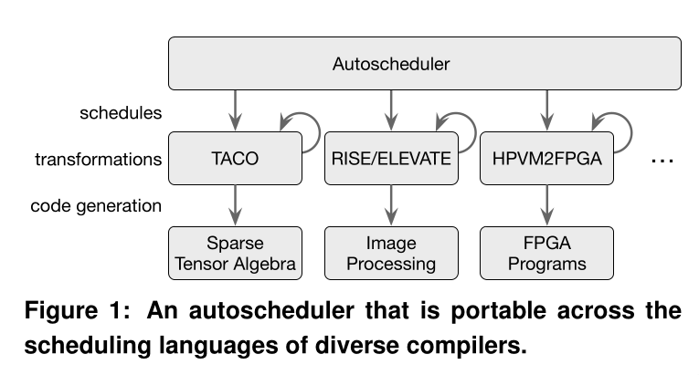
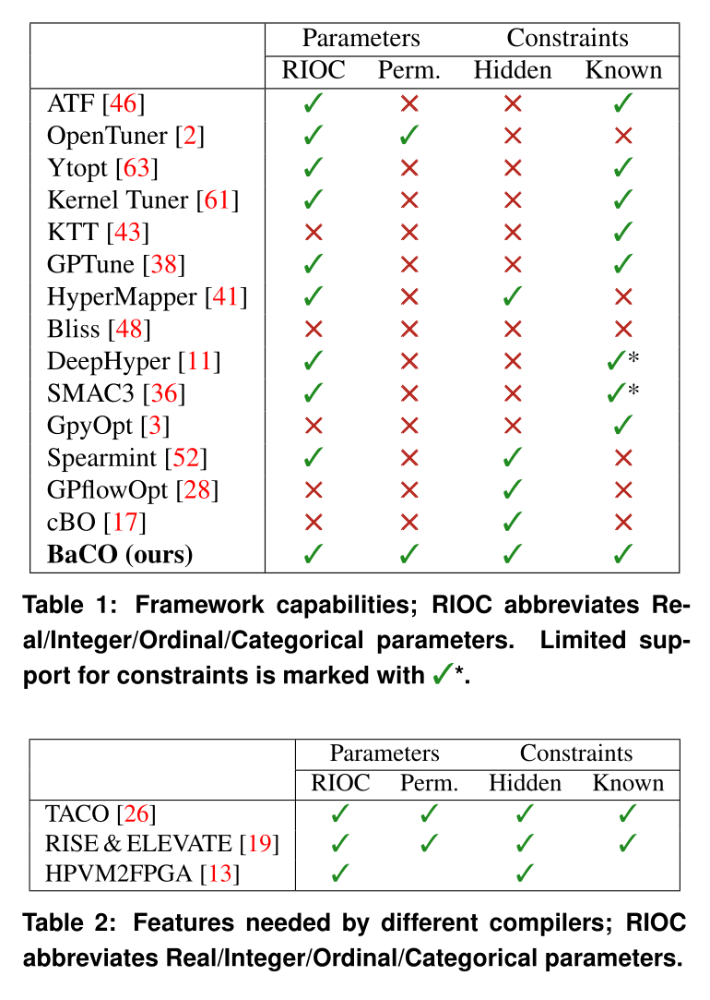

# Read paper

- *BaCO: A Fast and Portable Bayesian Compiler Optimization Framework* arXiv:2212.11142v2

## abstract

- 什么是 `autoturning`，自动调优？
- `Bayesian opt`是啥，起什么作用？
- 如何可扩展？

## introduction

- 现状
  - 分离策略：用调度语言分离 算什么(人的视角)-怎么算(机器的视角)
    - example: `TVM` `Halide` `TACO` `RISE` `ELEVATE`
    - 问题: 优化空间复杂
    - 需要: 更高效/有效的自动调优

- BaCO 干的：**Portable**
  - 把不同的编译器绑起来，把`autosheduling`的部分提到BaCO中去
    
  - 难点：
    - 要能准确的描述不同编译器的优化搜素空间，而优化搜索空间由 **目标硬件**、**编译器的调度语言**、**调优参数配置** 决定
    - 优化空间(RIPOC)：
      - continuous params - real
      - discontinuous params - int
      - permutation categories - 例循环展开
      - ordinals/ordered categories - 例因子展开
      - categoricals/unordered categories - 例并行模式
      - 参数之间存在依赖与约束，大如这些参数的笛卡尔积的搜索空间度不够用
      - 还有初始不知道的但是必须在自动调优期间知道的约束条件(隐式约束)，如硬件约束
      - 做通用、有用的自动调优框架，需要支持尽可能多的特性
    - 在优化空间之后要关心的是生成的代码
      - cost model：分析性的、数据驱动的。最准确的cost model是在目标平台上跑的

> 需要了解的背景：到底在优化啥？RIPOC到底是啥？拆开一个黑盒子看看。

- 现有的工作的不足
  - `BaCO`认为`autotuner`要支持的特性：
    - RIOC
    - Perm
    - Hidden
    - Know
    > RIOC是优化空间里的，Perm是 permutation，合在一起就是上面的RIPOC。从Tabel 1里看很少Framework支持Perm的

- `BaCO`的工作：
  - 不用用户提供代价模型，采用从运行成的优化代码中学习
  > 怎么个学习法？
  1. 支持所有RIPOC特性
  2. 隐藏约束、新编译后端易集成
  3. 采用chain-of-tree技术在Bayesian优化上，便于在稀疏搜索空间优化
  > 什么是 Chain of tree ? 把所有合法配置预选计算好，形成一个合法的配置
  4. 在三个不同编译框架上用Autotuning

## background: 现代自动调优的复杂性

> 有哪些复杂性？哪些框架我手头上的设备能够跑一跑？
>
> TACO、RISE&ELEVATE、HPVM2FPGA?  

#### TACO
[TACO](https://github.com/tensor-compiler/taco)

- 强项：给大量稀疏张量格式生成代码

#### RISE

[RISE](https://rise-lang.org/)

## BaCO design

